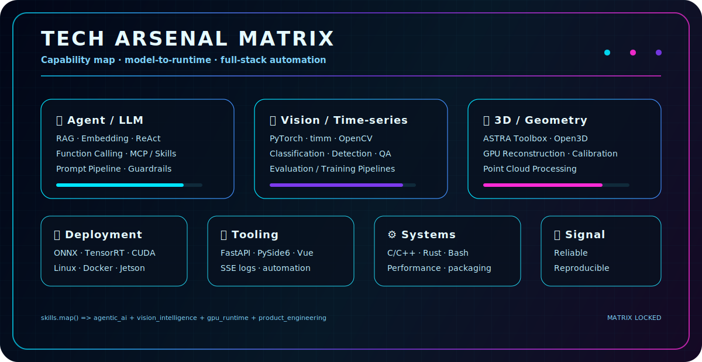
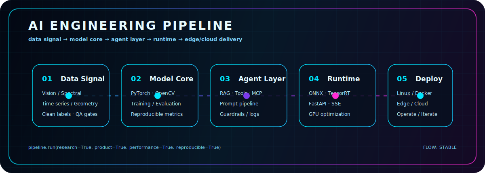
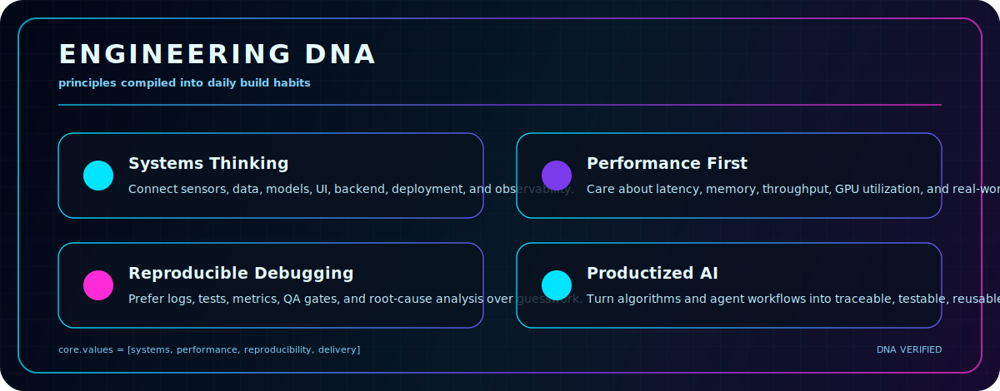

<!-- Cyberpunk Header -->

  

  

   

  
  
  
  

 

  

 

## 🧠 Command Center

  

---

## ⚡ Tech Arsenal

  

 

### 🧩 Capability Matrix

  

### 🛰️ AI Engineering Pipeline

  

---

## 🧬 Engineering DNA

  

---

## 🏆 Achievement Radar

  

---

## 📈 GitHub Intelligence

  
  

  

  

---

## 📊 Deep Metrics

  
<b>Click to expand lightweight GitHub metrics</b>

   
  

    <picture>
      
    </picture>
  

---

### `Code close to the metal. Think beyond the stack.`

