<!-- Cyberpunk Header -->
<div align="center">
  
</div>

<div align="center">

  

  <br />

  <a href="https://www.zhihu.com/people/luo-tuo-qing-shan-56-17"></a>
  <a href="https://abelxiaoxing.github.io/"></a>
  <a href="https://space.bilibili.com/8303485"></a>
  

</div>

<br />

<div align="center">
  
</div>

<br />

<div align="center">
  <table>
    <tr>
      <td align="center"><b><code>SYSTEM</code></b></td>
      <td align="center"><b><code>MODE</code></b></td>
      <td align="center"><b><code>STACK</code></b></td>
      <td align="center"><b><code>SIGNAL</code></b></td>
    </tr>
    <tr>
      <td align="center">AI Engineering Console</td>
      <td align="center">Research → Product</td>
      <td align="center">Python / CUDA / Linux</td>
      <td align="center">Always Building</td>
    </tr>
  </table>
</div>

---

## 🧠 About Me

```txt
$ whoami

Name        : Abel
Focus       : AI Agent Engineering / AI Full-stack / Industrial Vision / 3D Reconstruction
Languages   : Python, C/C++, Rust, Bash, CUDA, C#
Stack       : PyTorch, OpenCV, ONNX, TensorRT, FastAPI, Docker, Linux
Mindset     : Build reliable AI systems. Automate workflows. Ship reproducible tools.
Mission     : Technology has the power to make the world a better place.
Contact     : GitHub / Blog / Zhihu
```

- 👋 Hi, I'm **Abel** — an AI + systems builder focused on turning models, tools, and workflows into reliable software.
- 🤖 I build with **LLM/RAG/Agent workflows**, including prompt pipelines, tool calling boundaries, multi-provider model integration, and engineering guardrails.
- 👁️ I work across **computer vision, time-series modeling, 3D reconstruction, and edge AI deployment**.
- ⚙️ I care about **Linux-first development, reproducible pipelines, performance optimization, automated testing, and maintainable delivery**.
- 📚 Outside coding: reading, swimming, and writing technical notes.

---

## ⚡ Tech Arsenal


<div align="center">
  
</div>

<br />

<div align="center">


</div>

### 🧩 Skill Map

<table>
  <tr>
    <td><b>🤖 AI Agent / LLM</b></td>
    <td>RAG, Embedding, Function Calling, ReAct, MCP/Skills, prompt pipeline, multi-provider APIs, local model serving with vLLM / SGLang.</td>
  </tr>
  <tr>
    <td><b>👁️ Vision / Time-series</b></td>
    <td>PyTorch, timm, OpenCV, scikit-learn, spectral sequence modeling, classification / detection, multi-task training, evaluation pipelines.</td>
  </tr>
  <tr>
    <td><b>🧊 3D / Reconstruction</b></td>
    <td>ASTRA Toolbox, Open3D, GPU reconstruction, point cloud processing, geometry calibration, QA and reproducibility checks.</td>
  </tr>
  <tr>
    <td><b>🚀 Deployment</b></td>
    <td>ONNX, ONNX Runtime, TensorRT, CUDA, edge inference, PyInstaller packaging, Linux deployment, Dockerized services.</td>
  </tr>
  <tr>
    <td><b>🛠️ Full-stack Tools</b></td>
    <td>FastAPI, PostgreSQL, PySide6/PyQt, Vue, async tasks, SSE logs, automation scripts, CI-friendly test design.</td>
  </tr>
</table>

### 🛰️ AI Engineering Pipeline

<div align="center">

<table>
  <tr>
    <td align="center"><b>01</b><br/>Data Signal</td>
    <td align="center">➜</td>
    <td align="center"><b>02</b><br/>Model Core</td>
    <td align="center">➜</td>
    <td align="center"><b>03</b><br/>Agent Layer</td>
    <td align="center">➜</td>
    <td align="center"><b>04</b><br/>Runtime</td>
    <td align="center">➜</td>
    <td align="center"><b>05</b><br/>Edge / Cloud</td>
  </tr>
  <tr>
    <td align="center">Vision<br/>Time-series<br/>Geometry</td>
    <td></td>
    <td align="center">PyTorch<br/>OpenCV<br/>Reconstruction</td>
    <td></td>
    <td align="center">RAG<br/>Tools<br/>Workflows</td>
    <td></td>
    <td align="center">ONNX<br/>TensorRT<br/>FastAPI</td>
    <td></td>
    <td align="center">Linux<br/>Docker<br/>GPU</td>
  </tr>
</table>

</div>

---

## 🧬 Engineering DNA

<table>
  <tr>
    <td>🧱 <b>Systems Thinking</b></td>
    <td>Connect sensors, data, models, runtime, UI, backend, deployment, and observability into one coherent system.</td>
  </tr>
  <tr>
    <td>🚀 <b>Performance First</b></td>
    <td>Care about latency, memory, throughput, GPU utilization, model size, and real-world reliability.</td>
  </tr>
  <tr>
    <td>🔬 <b>Reproducible Debugging</b></td>
    <td>Prefer logs, tests, metrics, QA gates, and root-cause analysis over guesswork and one-off patches.</td>
  </tr>
  <tr>
    <td>🛠️ <b>Productized AI</b></td>
    <td>Turn experimental algorithms and Agent workflows into configurable, traceable, testable, reusable software assets.</td>
  </tr>
</table>

---

## 🏆 GitHub Trophies


<div align="center">
  
</div>

---

## 📈 GitHub Intelligence


<div align="center">
  
  
</div>

<div align="center">
  
</div>

<div align="center">
  
</div>

---

## 📊 Deep Metrics

<details>
  <summary><b>Click to expand lightweight GitHub metrics</b></summary>
  <br />
  <div align="center">
    <picture>
      
    </picture>
  </div>
</details>

---

<div align="center">

### `Code close to the metal. Think beyond the stack.`


</div>
